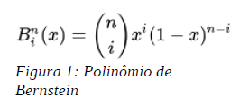
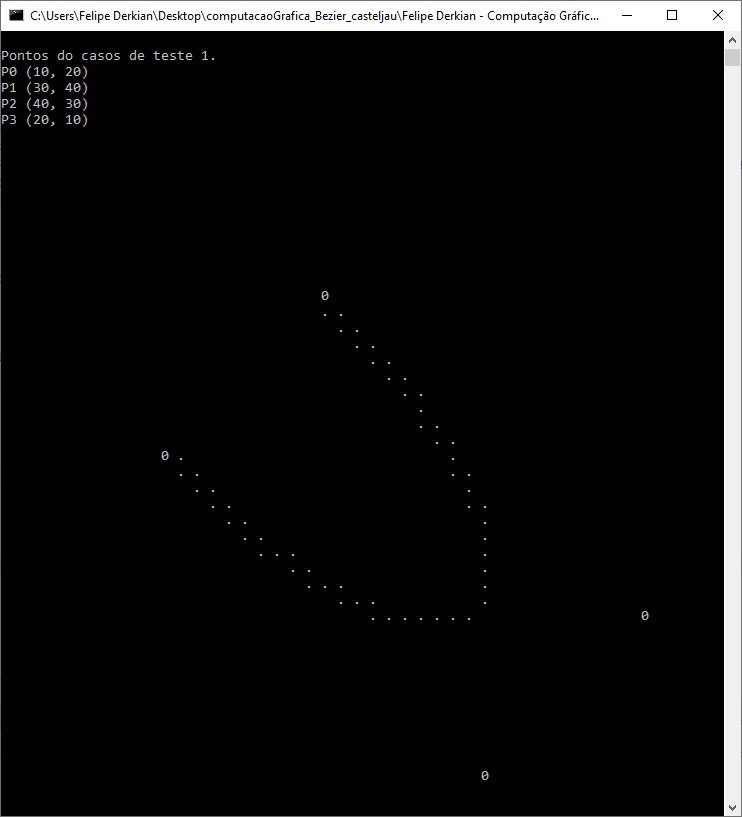
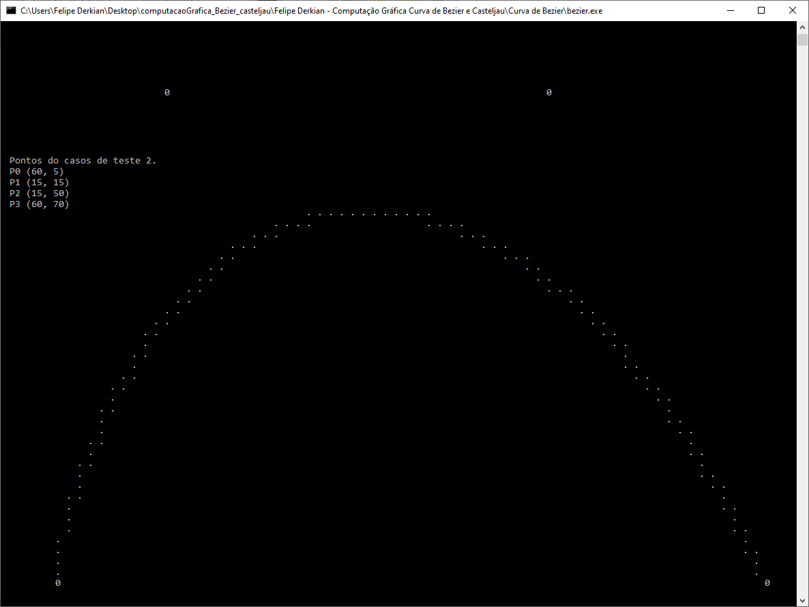
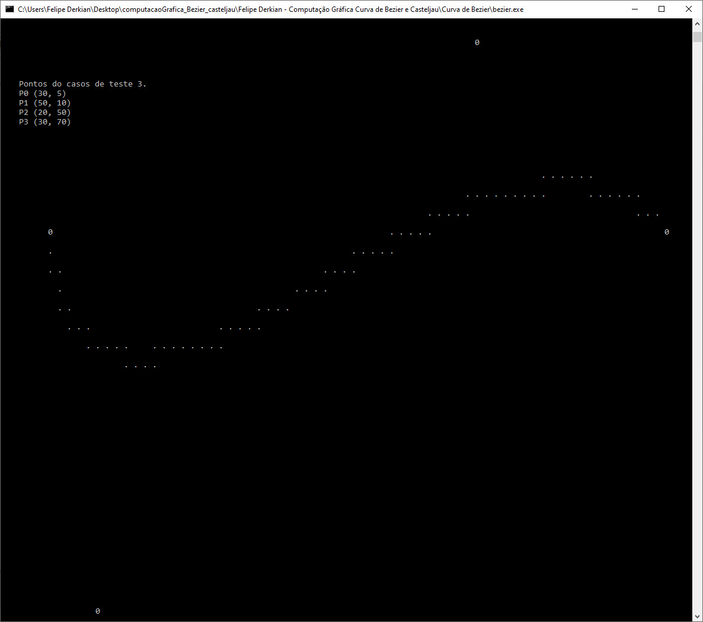
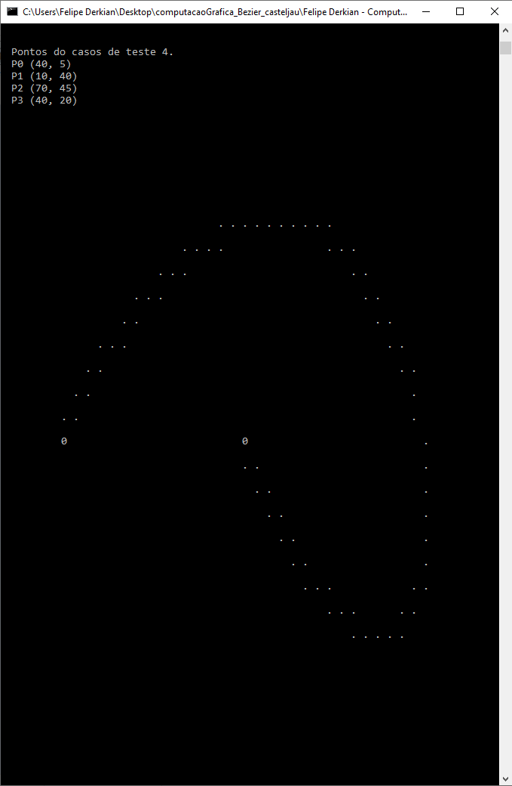
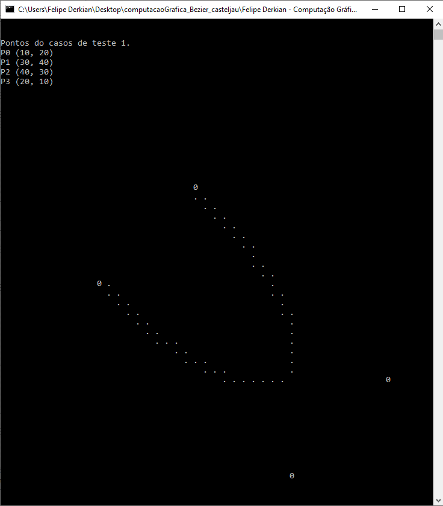
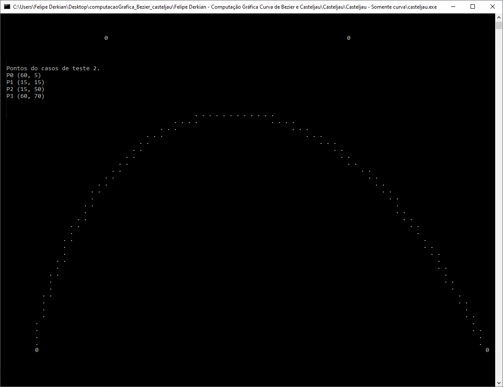
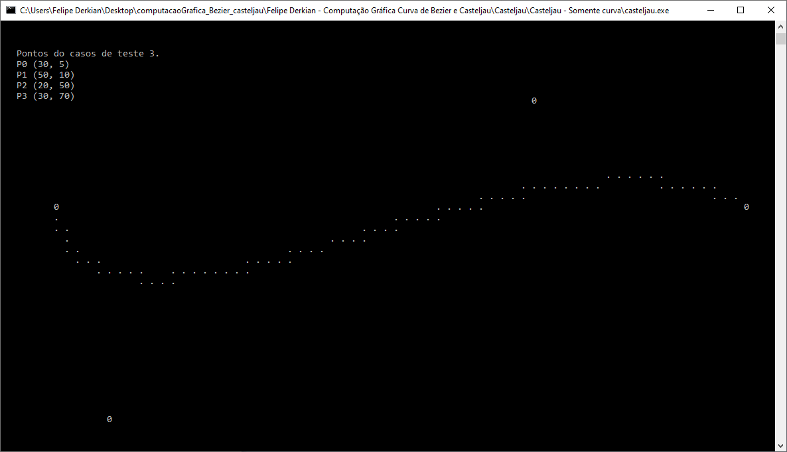

# CURVAS DE BÉZIER COM MÉTODO DA: EQUAÇÃO PARAMÉTRICA E CASTELJAU

---

## INTUIÇÃO

_“Como criar uma curva que começa em um ponto, termina em outro, e a sua forma depende de pontos de controle, que irão “puxar” ou “afastar” a curva de suas proximidades?”._

Uma resposta plausível para esta questão seria que temos que construir uma função que estabeleça o “peso” que cada ponto de controle em cada momento ao longo da curva possa usar esses pesos para fazer a curva suavizar de acordo com o peso ou força que esse ponto de controle
exerce sobre a linha.

## POLINÔMIO DE BERNSTEIN

Esse é o polinômio de Bernstein que foi usado por Bézier como base para construção da
curva. Onde (n i) é o polinômio de Newton, e o parâmetro x varia de 0 a 1.




# ALGORITMO DE BÉZIER - RESULTADO

```
CASO 1:
  
p1(10,20)
p2(30,40)
p3(40,30)
p4(20,10)
```


```
CASO 2:
  
p1(60,5)
p2(15,15)
p3(15,50)
p4(60,70)
```



```
CASO 3:
  
p1(30,5)
p2(50,10)
p3(20,50)
p4(30,70)
```


```
CASO 4:
  
p1(40, 5)
p2(10,40)
p3(70,45)
p4(40, 20)
```



# ALGORITMO DE CASTELJAU - RESULTADO

```
CASO 1:
  
p1(10,20)
p2(30,40)
p3(40,30)
p4(20,10)
```


```
CASO 2:
  
p1(60,5)
p2(15,15)
p3(15,50)
p4(60,70)
```


```
CASO 3:
  
p1(30,5)
p2(50,10)
p3(20,50)
p4(30,70)
```


```
CASO 4:
  
p1(40, 5)
p2(10,40)
p3(70,45)
p4(40, 20)
```


### PARA MAIS DETALHES LEIA O ARTIGO EM _.PDF_: Curvas de Bezier - Felipe Derkian.pdf

# OBRIGADO PELA ATENÇÃO.
